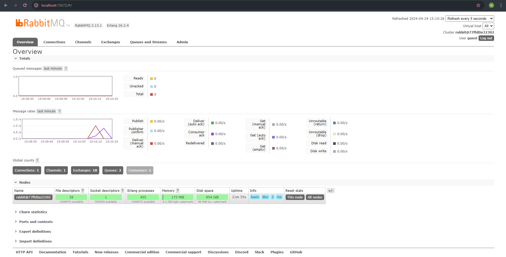

1. AMQP (Advanced Message Queuing Protocol) adalah protokol perangkat lunak yang digunakan untuk pertukaran message antar aplikasi atau sistem yang berbeda. AMQP memberi akses untuk aplikasi agar dapat berkomunikasi secara asynchronous. Oleh karenanya, pertukaran pesan dapat dilakukan tanpa harus terhubung satu sama lain secara real-time

2. `guest:guest@localhost:5672` adalah format address yang sering digunakan untuk mengakses dan mengelola server AMQP
* `guest:guest` adalah kombinasi nama pengguna dan sandinya. nama pengguna dan sandinya adalah guest
* `localhost` menunjukan bahwa server AMQP berjalan pada lokal
* `5672` nomor port (RabbitMQ) tempat server AMQP listening permintaan koneksi

#### slow subscriber

hal ini terjadi karena subscriber perlu waktu yang lebih lama untuk di queue yang mengakibatkan terjadinya penumpukkan message